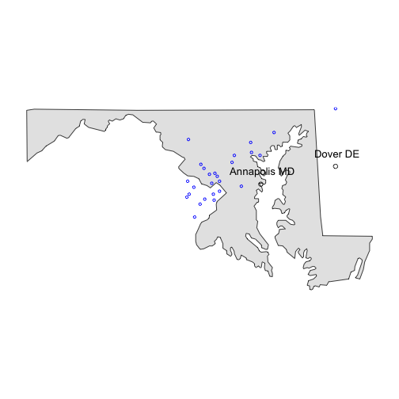
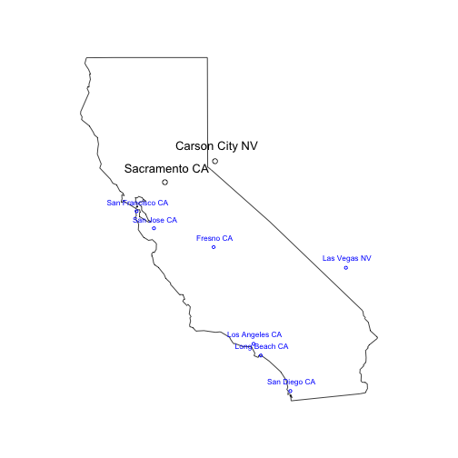

Interactive Data Analysis of City Populations
========================================================
author: H. Berg
date: 17 Aug 2015

========================================================

Interested to know more about where people live within the different states in the U.S.?

This presentation gives an overview of a web-based application that displays a selected state and the locations of cities within the state, based on the chosen city population threshold.  Also displayed are the state capital and near-by capitals within the map boundaries.

Key features of this application are:

- Graphically oriented, displays state maps and city locations
- Intuitive user interface presents menu choices and auto-fills as user types 
- Adjustable slider for population threshold designation

========================================================

## Intuitive user interface for selecting state and city population threshold

Two inputs are needed -- the state and the threshold population for displaying cities

> ### City Populations - Approximated as of January 2006  
>
>
>
> Start Typing to Select State (menu select or auto-fill options):  
> 
>  
> Cities with a Min Population of: (controls which cities will be on the map)  
>  

========================================================
left: 40%

Selecting a small population threshold will maximize the number of cities displayed on the map, however there may be too many names to display.  This example is the state of Maryland with a threshold population of 50,000.  A low threshold is a good way to start data exploration, after which the query can be tuned to be more granular.

*** 

 

========================================================
left: 30%

Example of output with larger population threshold selected.  This map displays the state of California with cities having a population threshold of 450,000.

***

 
